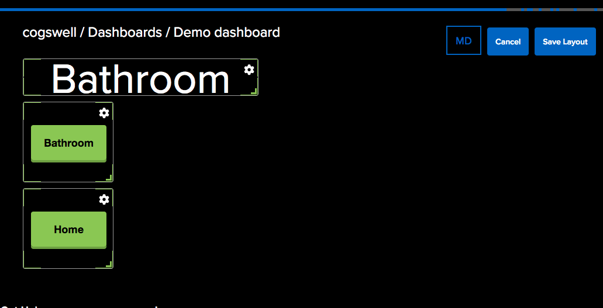
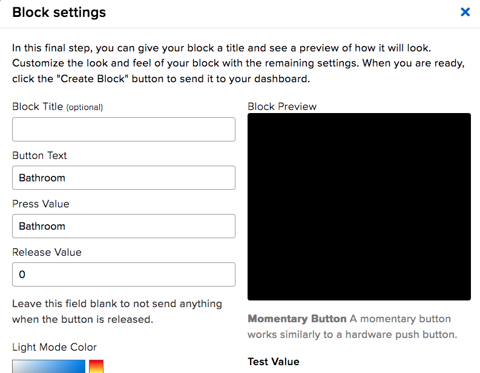

# A MagTag status display with Circuitpython you can update from remote. 

This Circuitpython program lets you use your Adafruit MagTag (https://www.adafruit.com/product/4800) as status board display. Hang it on your office door to let your co-workers know where you are. Put it on the fridge to remind your spouse to get Cheese. I dunno do what you want I'm not your dad.

This program uses Adafruit IO as a backing storage for the status message. The general idea:

1. Update status message through Adafruit IO (Make a nice dashboard with buttons, write your own app, use it on your phone or your desktop, whatever works for you)
1. Magtag reads the status message. If it's changed from what's being displayed, refresh the display. Chooses a font size and word wrapping to use the maximum space on the display and high quality text for the e-ink.
1. Magtag goes to deep sleep for a fixed period (2 minutes during 'working hours', 60 minutes during 'off hours') before waking up to check the feed again. With a 900 mAh battery I get about a week of this hanging on my office door before I have to recharge it.

It also displays the date of last refresh along the bottom of the screen, and will give an on-screen message if the battery voltage is low.

Optionally you can have it use the four neopixels to display status during a feed update (connecting to wifi, reading feed, reading time, updating display). Leave it off to be not-obtrusive with blinking lights. Set `USE_NEOPIXEL_STATUS = False` in `code.py` to turn them off. `True` to have them on.

Will automatically restart the microcontroller in the event of Wifi connection errors or Adafruit IO errors. In my normal use I don't encounter any problems that need me to manually intervene.

The MagTag uses a different style `secrets.py` setup to accomodate multiple Wifi networks. This way you can cart your MagTag around to different locations which might have different SSID's without having to re-program it. Add SSID's in `secrets.py` using `.append()` to the secrets list and when the Magtag wakes up it will scan and grab the first one in the list it can connect to. The functions for determining wifi network connection are in `wifi_select.py`

Configure `SLEEP_TIME` (default two minutes) as the time to sleep between feed checks. Longer sleep is more battery life, but longer sleep is more time between refreshes.

If the local time hour is not between `WORKING_HOURS_START` and `WORKING_HOURS_END` it will use `SLEEP_TIME_OFFHOURS` as the delay between refreshes (default one hour). Longer sleeps when nobody's around is more battery life. Make sure it starts refreshing before your actual work time starts so you don't have to wait a whole hour for an update.

You can always push the reset button on the side of the MagTag to make it update immediately.

I have these libraries in `/lib`. Do you need them all? Maybe not.
`adafruit_bitmap_font`, `adafruit_display_text`, `adafruit_imageload`, `adafruit_io`,
`adafruit_magtag`, `adafruit_minimqtt`, `adafruit_portalbase`, `adafruit_fakerequests`,
`adafruit_requests`, `neopixel`, `simpleio`

The included FreeSans pcf fonts are not the complete character set, to keep the file size small. You will find unicode character and possibly other things missing. Regenerate the fonts (or change the fonts, again I'm not your dad) if you want. https://learn.adafruit.com/custom-fonts-for-pyportal-circuitpython-display/conversion

## Creating the Adafruit IO feed

1. Call the feed `status` or change the feed id in the Magtag code.
2. Set feed history to 'off' (don't need all those old values)
3. Make it private if you don't others poking around at your status, unless you want it that way.

## Making a Dashboard

An IO dashboard works on mobile web (tested on iOS) or on Desktop. On iOS save it as a bookmark or even better as an icon on your desktop so the Dashboard is guaranteed to be refreshed when you launch it (blue bar at top of screen instead of the red bar). If the dashboard is not in contact with IO (red bar) it will not push values to your feed and your MagTag will not update.

I added a text field in mine so I can put free-form text in as a status, just remember you have to push "Enter" to have the control update the feed.

For momentary buttons, just have them emit the status you want as a value, so pushing the button sends that value to your feed. Remove the "release value". Make as many buttons as yout want.

## Fun Fact

Originally I thought this was going to need for me to run an entire custom web service behind it until I realized I could do everything I needed with Adafruit IO. I bought a domain and everything.